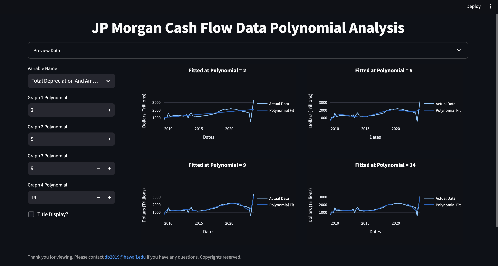

# JP Morgan Cash Flow Data Polynomial Fitting
Polynomial fitting of time series data involves using polynomial functions to approximate and model the underlying trend within the data. This method aims to capture the overall pattern or shape of the time series by fitting a polynomial equation to the data points. The degree of the polynomial determines the complexity of the model, with higher degrees offering more flexibility but risking overfitting. Polynomial fitting can be useful for smoothing noisy data, identifying long-term trends, or making short-term predictions. However, it's important to be cautious of overfitting and to consider the appropriateness of the polynomial degree based on the characteristics of the data and the desired modeling goals.

This project analyzes J.P. Morgan's cash flow data, which provides insights into the financial activities of the company. Here's a brief rundown of some key categories in the data (JPcashflow.csv):

Total Depreciation And Amortization - represents the total amount of depreciation and amortization expenses recorded by the company during a specific period, which impacts its cash flow.

Other Non-Cash Items: This category includes any non-cash transactions or items affecting the company's financial performance, excluding depreciation and amortization.

Total Non-Cash Items: The sum of all non-cash items affecting the company's financial statements, providing a comprehensive view of non-cash activities.

5-8. Changes in Accounts Receivable, Inventories, Accounts Payable, and Assets/Liabilities: These categories track changes in various assets and liabilities over a period, reflecting the company's operational and financial activities.

Cash Flow From Operating Activities: This is the net cash generated or used by the company's core business operations during the reporting period.

11-18. Net Changes in Property, Plant, and Equipment, Investments, Debt, and other Investing and Financing Activities: These categories detail the company's investing and financing activities, including changes in assets, liabilities, investments, and debt.

Cash Flow From Financial Activities: This represents the net cash flow generated or used by the company's financing activities, such as issuing or repurchasing equity or debt.

Net Cash Flow: The overall net cash flow generated or used by the company during the period, taking into account cash flows from operating, investing, and financing activities.

28-29. Stock-Based Compensation and Common Stock Dividends Paid: These categories reflect the company's compensation practices and dividend payments to shareholders, respectively.

## Installation
To install the project dependencies, run:
pip install -r requirements.txt

## Usage
Basic instructions on how to use the project:

On your computer, navigate to the repository's folder and type the following in the terminal:
streamlit run polyregress.py

note: depending on your python setup, you may have to include 'python' or 'python3' in front of the command.

## Project Structure
Overview of the project's structure:

project-root/

├── py/ - polyregress - polynomial regression model.

├── py/ - webscrape - extracts data using selenium drivers from webpage.

├── csv/ - JPcashflow - extracted data in csv form.

├── png/ - Dashboard_Preview - Preview of dashboard.

├── requirements.txt - Project dependencies.

├── .gitatributes - Text handling.

└── README.md - This file.

## Contact Information
For questions, please contact David Bannister at (https://www.linkedin.com/in/david-bannister-230a67191/).